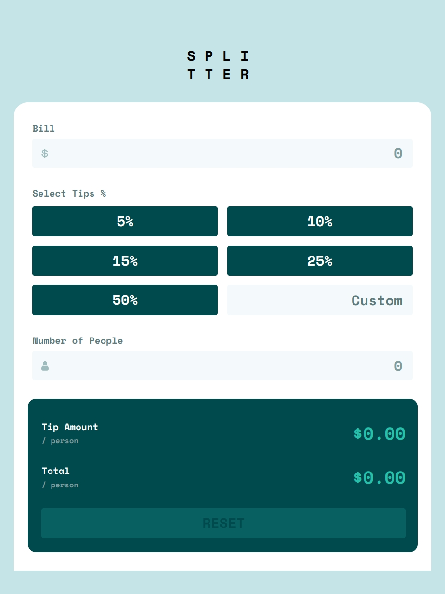

# Frontend Mentor - Tip calculator app solution

This is a solution to the [Tip calculator app challenge on Frontend Mentor](https://www.frontendmentor.io/challenges/tip-calculator-app-ugJNGbJUX). Frontend Mentor challenges help you improve your coding skills by building realistic projects.

## Table of contents

- [Frontend Mentor - Tip calculator app solution](#frontend-mentor---tip-calculator-app-solution)
  - [Table of contents](#table-of-contents)
  - [Overview](#overview)
    - [The challenge](#the-challenge)
    - [Screenshot](#screenshot)
    - [Links](#links)
  - [My process](#my-process)
    - [Built with](#built-with)
    - [What I learned](#what-i-learned)
    - [Continued development](#continued-development)
    - [Useful resources](#useful-resources)
  - [Author](#author)

## Overview

### The challenge

Users should be able to:

- View the optimal layout for the app depending on their device's screen size
- See hover states for all interactive elements on the page
- Calculate the correct tip and total cost of the bill per person

### Screenshot





### Links

- Solution URL: [GitHub URL](https://github.com/Adamskiee/tip-calculator-app)
- Figma Solution URL: [Figma URL](https://www.figma.com/design/5rpFA9pHeDjQlJWjBces7v/Tip-Calculator-App?node-id=0-1&p=f&t=i6t3ENPuwb1Bqd7p-0)
- Live Site URL: [Live Site URL](https://adamskiee.github.io/tip-calculator-app)

## My process

### Built with

- Semantic HTML5 markup
- CSS custom properties
- Flexbox
- CSS Grid
- Mobile-first workflow
- [Tailwind](https://tailwindcss.com/) - CSS Framework

### What I learned

- Working with event listener

```js
customTip.addEventListener("input", calculate);
bill.addEventListener("input", calculate);
peopleNum.addEventListener("input", calculate);
peopleNum.addEventListener("input", validatePeopleNum);

tips.addEventListener("click", tipsClick);

resetBtn.addEventListener("click", resetInput);

customTip.addEventListener("input", setTipsInactive);
```

- Working with input icon
  
```html
<div class="input-wrapper">
  <i class="icon"></i>
  <input type="number" id="people-num" name="people-num" class="input" placeholder="0">
</div>
```

- Organizing css file

### Continued development

1. I want to explore some JS Framework.

2. I want to learn how can I make my css file split into multiple files based on their layers.

### Useful resources

- [W3schools](https://www.w3schools.com/)
- [MDN Web Docs](https://developer.mozilla.org/en-US/)

## Author

- Frontend Mentor - [@Adamskiee](https://www.frontendmentor.io/profile/Adamskiee)
